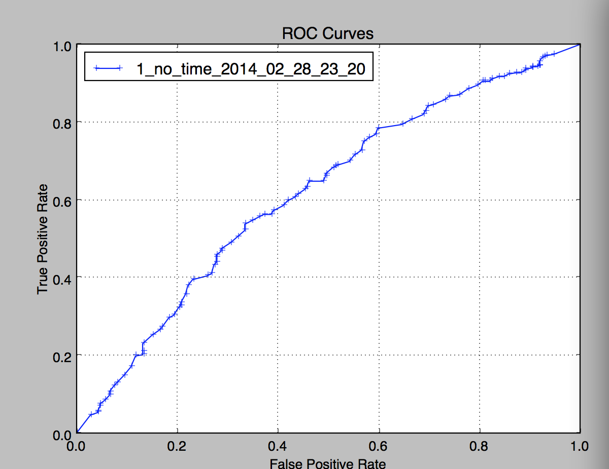
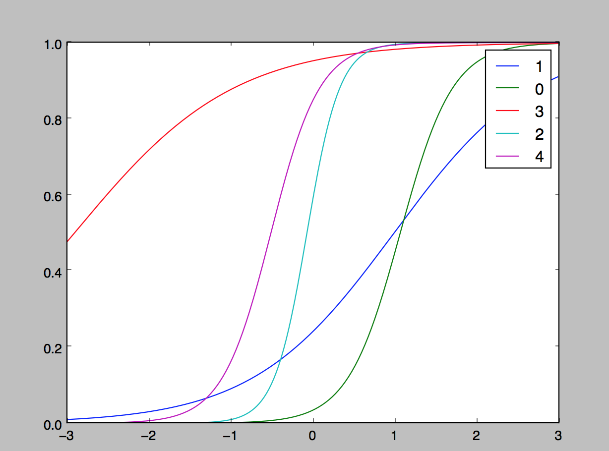

#guacamole
`guacamole` is a collection of tools we use at Khan Academy to train our models
from new data on a regular basis. These tools are meant to be compatible
with a variety of data formats from anyone who has learning data - especially
but not only data from online instruction.

**The Tools:**

The pipeline currently included here trains Multi-dimensional Item Response
Theory (MIRT) models, including both item correctness and response time if you
have that data (coming soon). The MIRT model is well suited to testing data (at Khan Academy, we use it for our assessments)

# guacamole walkthrough

#### **guacamole** is a useful tool for teachers and researchers to analyze and improve test items and students.

## getting started
###Getting guacamole to run:

####Get numpy, scipy, and matplotlib working
There are several strategies for this, depending on platform.

The normal and generally correct way to install Python libraries is using `pip`, but that often chokes on each of these. If installing with `pip` doesn't work, I recommend using the [Scipy Superpack](http://fonnesbeck.github.io/ScipySuperpack/) for Mac, or following the [SciPy Stack installation instructions](http://www.scipy.org/install.html) for Linux or Windows. For a heavier-weight but easy alternative, you can try [Anaconda](https://store.continuum.io/cshop/anaconda/).

I recommend installing `git` as well.

Next download guacamole:

`git clone git@github.com:Khan/guacamole.git`

Go to the guacamole directory and run

`./start_mirt_pipeline.py --generate --train -n 2 --visualize`

It should take less than a minute, and if some graphs pop up, you're good to go.
That `-n 2` is just to make things faster - this will not be a good model. It'll only learn for two epochs, and you probably want it to learn for about 15.

## Walkthrough

`guacamole` has a ton of features and abilities, and this walkthrough shows a few of them.

If you want a quick overview of what's available and you hate reading when it's not on the terminal, run

`./start_mirt_pipeline.py --help`

for an overview of the arguments

### Generate Data

Data is generated with

`./start_mirt_pipeline.py --generate`

This constructs a bunch of students with fake abilities, a bunch of exercises with fake difficulties, and simulates those students doing those exercises. You can examine the generated data in

`<PATH_TO_GUAC>/sample_data/all.responses`

It should look something like

    MERRIE,addition_1,1,True
    MERRIE,identifying_points_1,1,False
    YOSHIKO,addition_1,1,True
    YOSHIKO,slope_intercept_form,1,True
    YOSHIKO,graphing-proportional-relationships,1,True
    YOSHIKO,constructions_1,1,True
    CAITLYN,addition_1,1,True
    CAITLYN,identifying_points_1,1,True
    HORTENSE,vertical_angles_2,1,False
    HORTENSE,visualizing-and-interpreting-relationships-between-patterns,1,True
    HORTENSE,slope_intercept_form,1,False
    MENDY,graphing-proportional-relationships,1,True
    MENDY,constructions_1,1,False

These columns are name, exercise, time_taken, and correct. You can read more about data formats in `train_util/model_training_util.py`

###Train a model

You can train a model on data with

`./start_mirt_pipeline.py --train`

By default, this looks at the place that generate writes - at `sample_data/all.responses`. If you're interested in using your own data, you can use

`./start_mirt_pipeline.py --train --data_file <PATH/TO/YOUT/DATA>`

**OPTIONAL: PARALLELIZATION)**
This will run for a while. If you want it to go faster, you can parallelize with the `-w` command. I use `-w 6` on my eight-core computer. On a cluster, the number of workers can be really big, and training can be really fast. On some systems, (like Ubuntu) this only works when you have `affinity` installed - if multiple workers does not result in any speedup, try `pip install affinity`.

Now that your model is trained, it's in `sample_data/models/model.json`. You can actually use this model to run an adaptive test now, or you can examine it in a more readable format. If you want to save your model somewhere else, send in `-m desired/model/file.json`.

###Examining Models

There are a few ways to examine a model and evaluate how good it is.

####Report
The simplest is to run

`./start_mirt_pipeline.py --report`

This prints out a formatted view of your exercises.

                                                  Exercise  Bias        Dim. 1
                         area-and-circumference-of-circles  0.1527      0.1627
                                    equation_of_an_ellipse  0.2390      0.0599
                              two-sided-limits-from-graphs  0.3392      0.0654
                                             subtraction_1  0.3454      0.1430
                                           scaling_vectors  0.3814      0.1886
                       dividing_polynomials_by_binomials_1  0.3991      0.3312
                                       area_of_triangles_1  0.4223      0.0746
                                                  volume_1  0.5618      -0.0479
                        understanding_decimals_place_value  0.8695      0.0884
    understanding-multiplying-fractions-and-whole-numbers   0.9794      0.1425

For more information on what these terms mean, check out [IRT on Wikipedia](https://en.wikipedia.org/wiki/Item_response_theory).

####ROC Curve
An [ROC curve](http://en.wikipedia.org/wiki/Receiver_operating_characteristic) is a simple way of comparing models for predictive accuracy when there are binary classifications. When we train a model, we hold out a test set, and the ROC goes through that set of assessment and makes predictions about the accuracy of users on random questions. To see a ROC curve, run

`./start_mirt_pipeline.py --roc_viz`

This will take a bit of time, as it simulates generating a ROC curve from your test data.

####Problems

The model used for each problem can be thought of as a model meant to predict the probability that a student will answer that problem correctly given their ability. Running

`./start_mirt_pipeline.py --sigmoid_viz`

gives you a visualization of each problem in that context.

###Scoring

So scoring here is relative - we don't give anything on a score of 0-100. Instead, we give the mean of the student's estimated ability, which should have a mean around 0 and be approximately normally distributed.

This prints a student's id and their score. For instance:

    NATASHA -0.281607745587
    EMA -0.423702530148
    HUNG 0.135014957553
    IAN 1.00330296356
    JANNET 0.141838668862
    JAN 0.205517676995
    LOUETTA 0.145722766169
    RACHEAL 0.102205839596
    LOUVENIA 0.0097095052554
    SOLEDAD 0.400148176133
    KAYLENE -0.409522253404
    KATHRYN 0.245113015341

I got these names from the census, in case you're wondering. I really like the internet.

You can score with `./start_mirt_pipeline.py --score`

### Adaptive Test
Any time after training, we can create an adaptive test that gets the most information possible per question.

Start taking the interactive test with

`./start_mirt_pipeline.py --test`

You can specify the number of questions you'd like in your interactive test with `-i`

This isn't super cool by itself, because it just simulates answering questions correctly (1) or incorrectly. But it should be easy to hook this up as the backend to an interactive adaptive testing engine - that's what we do at Khan Academy.

**The Algorithms**

`guacamole` aspires to be a general purpose library with a spectrum of commonly used algorithms for analyzing educational data (especially at scale). For now, we support a few common algorithms.

*Multidimensional Item Response Theory*

Item response theory is a classic technique in psychometrics to calibrate tests and test items with student abilities, resulting in difficulty ratings for test items and ability ratings for students.

**Visualizations**

A few visualizations are available for the data.

First, you can see an ROC curve given your parameters:
`--roc_viz`

You can also see graphs of each exercise by difficulty and discrimination
`./start_mirt_pipeline.py --sigmoid_viz`

To see how well each student did, call
'./start_mirt_pipeline.py --score'

**The names**

The names are from the US census bureau.

**Khan Academy Data**

This library is designed to be used on Khan Academy data. We have sample, non-student, data in that format now.
If you are interested in using our real data at scale in your research, you should visit [http://khanacademy.org/r/research](http://khanacademy.org/r/research), and then email us at [research@khanacademy.org](mailto:research@khanacademy.org).

If these tools are useful to you, let us know! If you'd like to contribute,
you can submit a pull request or
[apply to work at Khan Academy](https://www.khanacademy.org/careers) - we're hiring data
scientists and software engineers for both full time positions and internships.

Authors: Eliana Feasley, Jace Kohlmeier, Matt Faus, Jascha Sohl-Dickstein (2014)
